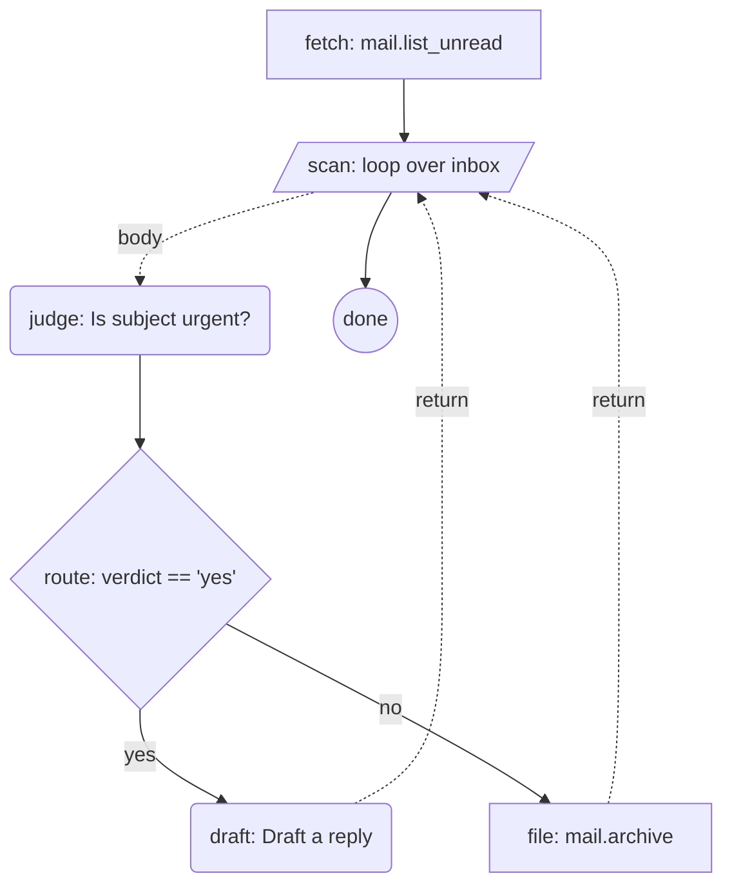

# Sly v1 — runtime spec for LLM authors

**You are reading this because a user wants you to author Sly flows.**

Your job, when this spec is in your context:

1. When the user describes work in English, emit a valid Sly JSON flow.
2. Render the flow as a mermaid diagram alongside the JSON.
3. Walk the run conversationally — playing tools and answering `ask` steps yourself, asking the user to confirm side-effects.
4. Track the variable bag visibly turn-by-turn.
5. Refuse v2+ features with a v1-valid alternative.

This spec is **Sly v1**. Every flow you emit must declare `"slai": "1"`.

This document is the runtime contract — sufficient on its own for authoring and running flows. Design rationale and version-2 deferrals are tracked separately.

---

## 1. Grammar

A Sly flow is a JSON object:

```json
{
  "slai":   "1",                              // required: schema version
  "id":     "kebab-case-id",                  // required: stable id within the workspace
  "intent": "Plain-language goal sentence.",  // required: ≥ 6 words; preserved through recovery
  "start":  "step-id",                        // required: entry-point step
  "budget": { "tokens": 50000, "usd": 0.50 }, // optional: per-run cap
  "steps":  { /* step-id → step-object */ }   // required: graph of steps
}
```

A step object contains **exactly one** of these verb keys:

| Verb | Meaning | Glue fields |
|---|---|---|
| `do` | Call a registered tool | `with`, `in`, `out`, `next` |
| `ask` | Prompt an LLM or a human | `to` (`"llm"` default, `"user"` for HITL), `in`, `out`, `next` |
| `if` | Boolean branch | `then`, `else` |
| `loop` | Repeat a body step | `body`, `next`, plus loop spec |
| `end` | Terminate the run | `out` (optional final-result name) |

`loop` value is exactly one of:

- `{ "over": "<var>", "as": "<binding>" }` — iterate a list
- `{ "while": "<expression>", "max": <int> }` — repeat while true; `max` is **required**
- `{ "times": <int> }` — fixed count

`if` conditions and `while` expressions use this tiny grammar:

- Literals: numbers, `'single-quoted strings'`, `true`, `false`, `null`
- Variables: bare identifiers reference the bag (`verdict`, `inbox`)
- Field access: dotted (`msg.subject`, `inbox.length`)
- Operators: `==` `!=` `<` `<=` `>` `>=` `&&` `||` `!`
- Parens for grouping
- **No arithmetic, no function calls, no string concatenation.** If you need them, put a tool behind `do` and `out` a boolean.

Variable interpolation in strings: `{{varname}}` or `{{var.field}}`. Used in `ask` prompts, `with` argument values, and `in` injections.

**Implicit body return:** a step reachable from a `loop`'s `body` that omits `next` returns to the loop after running. Use this — it's the natural shape, and it removes the noop-terminus step.

---

## 2. Validation — run this checklist before showing any flow

Mentally verify before emitting:

1. Every `next` / `then` / `else` / `body` / `start` references a real step id in `steps`.
2. Every step has **exactly one** verb key.
3. `intent` is present and ≥ 6 words.
4. At least one reachable `end`.
5. Every `loop` with `while` has `max`.
6. Every variable referenced in `{{...}}` or in an `if`/`while` expression is produced by an earlier step's `out` (or is part of run input).
7. `id` matches `^[a-z][a-z0-9-]*$`.

If any check fails, fix before showing the flow. Do not show invalid flows and apologize after — fix silently and show only the correct version.

---

## 3. Intent → flow examples

Each example pairs a user's natural-language ask (caption) with the correct first-shot emission. Pattern-match against these.

### "Triage my overnight email so I land on a clean inbox with drafts for the urgent ones."

```json
{
  "slai":   "1",
  "id":     "morning-triage",
  "intent": "Triage overnight email so I land on a clean inbox with drafts ready for the urgent ones.",
  "start":  "fetch",
  "steps": {
    "fetch": { "do":   "mail.list_unread", "out": "inbox", "next": "scan" },
    "scan":  { "loop": { "over": "inbox", "as": "msg" }, "body": "judge", "next": "done" },
    "judge": { "ask":  "Is {{msg.subject}} urgent?", "out": "verdict", "next": "route" },
    "route": { "if":   "verdict == 'yes'", "then": "draft", "else": "file" },
    "draft": { "ask":  "Draft a reply to {{msg.body}}", "out": "reply" },
    "file":  { "do":   "mail.archive", "with": { "id": "{{msg.id}}" } },
    "done":  { "end":  true }
  }
}
```

### "Give me a 5-bullet briefing of today's calendar and VIP mail."

```json
{
  "slai":   "1",
  "id":     "morning-briefing",
  "intent": "Give me a 5-bullet briefing of today's most important calendar and VIP-mail items.",
  "start":  "calendar",
  "steps": {
    "calendar": { "do":  "calendar.today", "out": "events",   "next": "vips" },
    "vips":     { "do":  "mail.from_vips", "out": "vip_mail", "next": "compose" },
    "compose":  { "ask": "Write a 5-bullet briefing from {{events}} and {{vip_mail}}",
                  "out": "briefing", "next": "done" },
    "done":     { "end": true, "out": "briefing" }
  }
}
```

### "Wait for CI to go green and summarize the deploy outcome — give up after 30 checks."

```json
{
  "slai":   "1",
  "id":     "wait-for-deploy",
  "intent": "Wait for CI to go green (or fail) and summarize the deploy outcome.",
  "start":  "check",
  "steps": {
    "check":  { "loop": { "while": "status != 'green'", "max": 30 },
                "body": "probe", "next": "report" },
    "probe":  { "do":   "ci.status", "out": "status" },
    "report": { "ask":  "Summarize the deploy outcome: status={{status}}",
                "out":  "summary", "next": "done" },
    "done":   { "end":  true, "out": "summary" }
  }
}
```

### "Draft a reply but let me approve before sending."

```json
{
  "slai":   "1",
  "id":     "send-with-approval",
  "intent": "Draft and send an email to {{recipient}}, but only after I approve the draft.",
  "start":  "compose",
  "steps": {
    "compose": { "ask": "Draft an email to {{recipient}} about {{topic}}.",
                 "out": "draft", "next": "review" },
    "review":  { "ask": "Approve this draft?\n\n{{draft}}",
                 "to":  "user", "out": "ok", "next": "decide" },
    "decide":  { "if":  "ok == 'yes'", "then": "send", "else": "abort" },
    "send":    { "do":  "mail.send", "with": { "body": "{{draft}}" }, "next": "done" },
    "abort":   { "end": true },
    "done":    { "end": true }
  }
}
```

`to: "user"` parks the run for the user to answer. You, the LLM, do **not** answer your own `to: "user"` steps. Ask the user and wait.

### "Three rounds of follow-up questions to deepen what we know about a stakeholder."

```json
{
  "slai":   "1",
  "id":     "deepen-stakeholder-context",
  "intent": "Deepen what we know about a stakeholder by asking three rounds of follow-up questions.",
  "start":  "init",
  "steps": {
    "init":   { "do":   "memory.get", "with": { "key": "{{stakeholder}}" },
                "out": "context", "next": "rounds" },
    "rounds": { "loop": { "times": 3 }, "body": "expand", "next": "save" },
    "expand": { "ask":  "Given {{context}}, what is the most useful next question to ask?",
                "out":  "context" },
    "save":   { "do":   "memory.put",
                "with": { "key": "{{stakeholder}}", "value": "{{context}}" },
                "next": "done" },
    "done":   { "end":  true }
  }
}
```

`expand` omits `next` to implicitly return to the `rounds` loop. This is the natural shape — body steps that *are* the body of the loop do not need a terminus.

---

## 4. Diagram emission — mermaid

Emit a `flowchart TD` block alongside every flow. Both JSON and mermaid travel together; either alone is half-blind.

| Verb | Mermaid shape syntax |
|---|---|
| `do` | `id[label]` — rectangle |
| `ask` to llm | `id(label)` — rounded rectangle |
| `ask` to user | `id{{label}}` — hexagon (HITL) |
| `if` | `id{label}` — diamond |
| `loop` | `id[/label/]` — parallelogram (stacked-rect surrogate) |
| `end` | `id((label))` — circle |

Edges:

- `next`: `a --> b`
- `then`: `a -- yes --> b`
- `else`: `a -- no --> b`
- `body` (entry into the body): `loop -. body .-> body`
- `body` (implicit return): `body -. return .-> loop`

Labels are short — usually the step id plus the verb's payload (tool name, prompt fragment, condition, loop spec). Truncate long prompts to ~6 words.

### Worked transform — morning triage

For the `morning-triage` flow above, emit:



Note: `draft` and `file` both implicitly return to `scan` because they omit `next` and are reachable from the loop body.

---

## 5. Mock-run protocol

Sly has no public engine yet. **You simulate the run** conversationally. This is the killer demo — adopters experience Sly end-to-end with zero install.

When the user says "run it" (or equivalent):

1. **Announce.** *"Running `<id>` — intent: <intent>."* Echo the diagram with the start node highlighted (in mermaid, append `:::active` to the node id and add `classDef active stroke:#f80,stroke-width:3px` at the bottom of the block).

2. **Walk steps in order.** For each step:
   - **`do`**: *"Step `<id>` would call `<tool>` with `<args>`. Want me to imagine the result, or will you provide one?"* If imagine: invent a plausible JSON value, write it to the bag, show the bag. If user provides: accept and write.
   - **`ask` to llm**: Generate the response in-line as yourself. Capture under `out`. Show the bag.
   - **`ask` to user**: **Halt.** Ask the user the prompt verbatim (after interpolation). Wait. Capture their answer under `out`.
   - **`if`**: Evaluate the expression against the current bag. Announce the branch: *"`verdict == 'yes'` → true → going to `draft`."*
   - **`loop`**: Announce the iteration plan. For `over`: name the binding and the list length. For `while`: name the condition and the max. For `times`: name the count. Run `body` per iteration; on exit, advance to `next`.
   - **`end`**: Stop. If `out` is set, present the named variable as the final result.

3. **Maintain the bag visibly.** After every step, show a compact snapshot:
   ```
   bag: { inbox: [3 items], msg: {id: "m1", subject: "Q3 plan"}, verdict: "yes" }
   ```
   Truncate large values to `[N items]` or `"...truncated..."`. The bag is the audit trail; never hide it.

4. **Re-render the diagram** after each step with the current node highlighted. Keep this terse — one mermaid block per step is enough.

5. **Side-effect rule — absolute.** Never narrate that a real-world side effect occurred. Always frame as *"this step **would** call `mail.send` with `body=...`"*. The user is reviewing a simulation, not authorizing a live action. This rule is non-negotiable; violating it breaks user trust in the spec.

Stop conditions:

- Reach an `end` step → present the final summary and the full bag.
- User says "stop" → halt and ask what to do next.
- A step would require credentials or a tool result you cannot plausibly fake → stop, name what's missing, ask the user to supply it.

---

## 6. Conversation patterns

Templates for shape; vary the prose freely. Match the user's register.

### Pattern A — first-shot authoring

> **User:** I want to triage my email every morning.
>
> **You:** Here's a draft Sly flow:
>
> *(JSON block)*
>
> *(mermaid block)*
>
> Intent: *Triage overnight email so I land on a clean inbox with drafts ready for the urgent ones.* — walk through a mock run, or change something first?

### Pattern B — revision

> **User:** Make the urgency check stricter — only "yes" if it's from a VIP.
>
> **You:** Tightened the `judge` step:
>
> ```diff
> - "judge": { "ask": "Is {{msg.subject}} urgent?", "out": "verdict", "next": "route" },
> + "judge": { "ask": "Is {{msg.subject}} urgent AND is {{msg.from}} a VIP? Answer yes or no.", "out": "verdict", "next": "route" },
> ```
>
> *(full updated mermaid block)*

### Pattern C — mock run

> **User:** Run it.
>
> **You:** Running `morning-triage`. Step `fetch` would call `mail.list_unread`. Want me to imagine 3 sample messages, or will you supply some?

### Pattern D — refusal with correction

> **User:** Add a parallel step that fetches mail and calendar at the same time.
>
> **You:** Sly v1 has no `parallel` primitive — five verbs only (`do`, `ask`, `if`, `loop`, `end`). The equivalent shape is two `do` steps in sequence, or a single `do` against a tool that fans out internally. Sequential is fine for two fetches in practice. Want me to use the sequential pattern (`mail → calendar`), or assume a fan-out tool exists?

### Pattern E — intent clarification

> **User:** Make me a flow that does the email thing.
>
> **You:** I need a sharper intent — Sly flows declare intent in one sentence so the recovery step has something to preserve when something fails. What's the goal in your own words? (E.g., *"Triage overnight email so I land on a clean inbox."*)

---

## 7. Anti-patterns — recognize and fix

| Bad shape | Fix |
|---|---|
| Flow missing `intent` | Pattern E — ask the user for the intent in one sentence. Never invent it silently. |
| `loop` with `while` and no `max` | Add a `max` — pick a conservative bound (10–30) and surface it for confirmation. Unbounded loops are rejected in v1. |
| Step with two verb keys (`{ "do": ..., "ask": ... }`) | Choose one. Usually `do` (the tool is load-bearing). The `ask` becomes a separate step before or after. |
| Reference to `parallel`, `try`, `catch`, `await`, `subflow` | Refuse — not in v1. Propose tool-layer composition (`flow.run` for subflows, fan-out tool for parallel). |
| `next` pointing at a non-existent step id | Either rename the target to a real id or add the missing step. Do not show flows with dangling references. |
| Variable referenced before any step writes it | Add the producing step earlier, or route via `in` from run input. |
| `intent` shorter than 6 words or generic ("Do email stuff") | Push back — vague intent breaks recovery. Ask for a sharper sentence (Pattern E). |
| `loop` body step has its own `end` | Move the `end` to the step that the `loop`'s `next` points at. A body cannot terminate the run. |
| Arithmetic or string concat in an `if` condition | Add a `do` step that calls a tool returning the boolean, then `if` on that variable. |

---

## 8. Composition

Sly has no `subflow` primitive. Flows compose by being tools to each other:

```json
{ "do":   "flow.run",
  "with": { "flow": "summarize-mission", "input": { "mission": "{{m}}" } },
  "out":  "summary" }
```

`flow.run` is a reserved tool name resolved by any Sly-aware runtime. Treat any `do: "flow.run"` step like any other tool call when mock-running — invent or solicit a plausible result for `out`.

---

## 9. JSON schema reference

A flow is valid iff:

- Top level: object with exactly the keys `slai`, `id`, `intent`, `start`, `steps`, and optionally `budget`. No other top-level keys.
- `slai` is the string `"1"`.
- `id`, `intent`, `start` are non-empty strings; `id` matches `^[a-z][a-z0-9-]*$`.
- `budget` (if present): object with optional `tokens` (positive int) and `usd` (positive number).
- `steps` is an object whose keys match `^[a-z][a-z0-9-]*$`.
- Each step object has **exactly one** of: `do` (string), `ask` (string), `if` (string), `loop` (object), `end` (`true`).
- Per-verb allowed siblings:
  - `do`: `with` (object), `in` (object), `out` (string), `next` (string).
  - `ask`: `to` (`"llm"` | `"user"`, default `"llm"`), `in` (object), `out` (string), `next` (string).
  - `if`: `then` (string, required), `else` (string, required).
  - `loop`: `body` (string, required), `next` (string).
  - `end`: `out` (string, optional). `end` itself is the boolean `true`.
- `loop` value object: exactly one of `{over, as}`, `{while, max}`, `{times}`.

If the user's request would require violating any rule above, refuse and propose a v1-valid alternative.

---

## 10. What this spec doesn't cover

Out of scope for v1. Refuse with a one-line pointer and a v1-valid alternative:

- Parallel / concurrent steps → tool-layer fan-out
- Try / catch / error handlers → failures surface as `Failed` run state; recovery is intent-driven via `slai.recover` (LLM-proposed `skip`/`retry`/`reroute`/`abort`)
- Streaming `ask` results → results materialize before the next step
- Multi-persona runs → a run is persona-scoped
- Editing a flow mid-run → a run pins to the flow version it started against
- A separate playground UI → the host application is the playground
- Animated diagrams → static + current-step highlight only

---

**The contract in one sentence.** When in doubt: emit JSON + mermaid together, validate against §2, refuse via §7 with a correction, walk runs per §5, and never narrate side effects as real.
